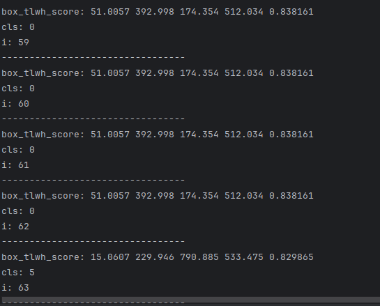

# RTMDET在snpe部署
RTMDET: https://github.com/open-mmlab/mmdetection/tree/3.x/configs/rtmdet 

RTMDET与其他算法的推理过程基本相同，主要在于HardSigmod算子SNPE不支持，并且这个算子比较简单，就借助snpe的udo自己实现了一下。这里主要记录snpe udo的使用过程。  
官方文档：https://developer.qualcomm.com/sites/default/files/docs/snpe/usergroup2.html

## REMDET
onnx模型下载路径：https://platform.openmmlab.com/deploee
* 输入：1 * 640 * 640 * 3  
* 输出：1 * 300 * 5、   1 * 300 前一个输出表示检测框加置信度（xyxy+score），后一个则是标签  

输出为300 * 5的原因是MMDeploy的模型已经集成了后处理，根据[模型配置文件](https://platform.openmmlab.com/deploee/onnx-detail?search=rtm%20static&tag=&page=1)可以看到后处理保留了300个结果。如果使用 [netron](https://netron.app/)  直接查看转换前的onnx模型，可以看到原本模型的应该是动态输出，输出数是1*num_dets。  
snpe不支持动态参数，所以在转换后变为了静态参数（在snpe1.68进行模型转换时，会直接报错，snpe2.10可以转换成功，会有Applying static reshape to 1239: new name 1241 new shape 的提示）。  
将snpe推理的结果打印出来，发现前60个左右的推理结果都是完全一样的。猜测，可能是经过处理后的框不足300个，进行了补全。  
  
为了防止动态形状推理的问题，同时转换了另一个版本的rtmdet，不保留后处理部分。  
* 输入：1 * 640 * 640 * 3  
* 输出：1 * 8400 * 80、  1 * 8400 * 4  

这样就比较好理解了，80表示coco的80类别，4是检测框。8400 = 6400 + 4600 + 400，表示RTMDET在三个尺度预测结果，  大小分别为 6400 (80 x 80)、1600 (40 x 40)、400 (20 x 20)。  

## udo定义
参考./snpe_udo/SNPEUDP.md。

